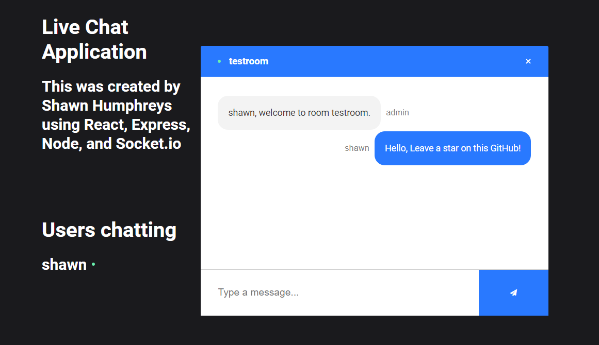
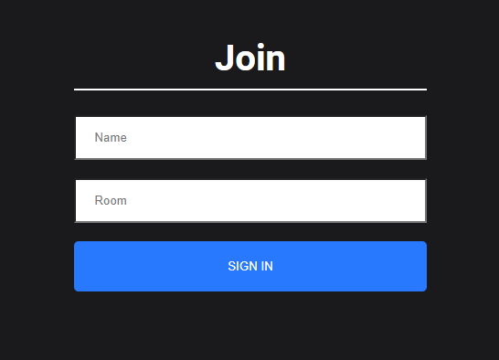

# React Chat Application

Live site - <https://react-chat-page.netlify.app>

## Client

Client folder is utilizing create-react-ap and socket.io-client. You must use Yarn Start to load the application.

## Server

The server is powered by Nodejs and Express. To run the server, you will need to use NPM Start. For fast real-time chat messages, the chat application is running under Socket.io. 

Server has been deployed under Heroku. 

## Thank You

There are more features to be added, so stay tuned! Please feel free to reach out for any questions!

(Here is example of a good commit message for Dev.to)